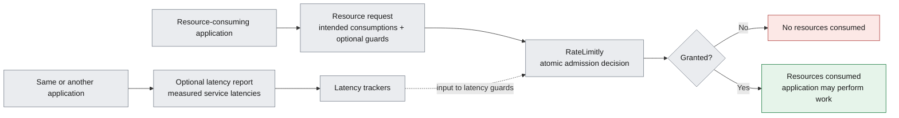

# RateLimitly Python Client (`ratelimitly`)

Official Python client library for **[RateLimitly](https://ratelimitly.com/)** distributed rate limiting, latency tracking, and adaptive load shedding.

---

## What RateLimitly does

[RateLimitly](https://ratelimitly.com/), a distributed admission-control service, decides whether an application may begin work that consumes configured resources. The decision may also depend on whether recently observed service latencies remain below application-defined thresholds.

`ratelimitly` is the official Python library through which an application requests those decisions and, independently, contributes latency measurements used by future decisions.

---

## Core operations

The library exposes two independent operations:

- A **resource request** describes work the application wants to perform as one or more resource consumptions and zero or more latency guards. RateLimitly evaluates the request as one atomic decision. A grant consumes every requested quantity and authorizes the application to proceed; a rejection consumes none.
- A **latency report** contributes one or more measured service latencies to the trackers used by latency guards in later resource requests. It neither requests nor consumes resources and does not itself make an admission decision.

An application may use either operation without the other. A common workflow is to request permission for some work, perform it only after a grant, and then optionally report measured latencies for services used by that work.



---

## Features

- **Status Code Errors**: Returns raw status codes (`RCLIENT_OK`, `RCLIENT_ERR_TIMEOUT`, `RCLIENT_ERR_DNS`, etc.) for fine-grained application control.
- **Latency Guards & Load Shedding**: Evaluates latency guards (`LatencyGuard`) alongside resource requests to automatically shed traffic during downstream service degradation.
- **Background Latency Reporting**: Reports service response times (`ServiceLatencyReport` via `report_latency()`) to feed RateLimitly's server-side latency trackers.
- **Bech32 Credential Parser**: Parses `rl-aes1...` and `rl-cookie1...` API keys into key ID, auth mode, and secret bytes.
- **Identifier Derivation**: `r_client_derive_bucket_id()` and `r_client_derive_latency_tracker_id()` for canonical 16-byte BLAKE2s hashing.
- **HA Request Policies**: Support for `standard` (3-round), `single_round` (1-round), and `custom` schedules (`FixedSchedule`, `LinearSchedule`, `ExponentialSchedule`).
- **Sync & Async Interfaces**: Provides both `RateLimitlyClient` and `AsyncRateLimitlyClient` (`asyncio`).

---

## Installation

### From PyPI

```bash
pip install ratelimitly
```

### Directly from GitHub

```bash
pip install git+https://github.com/ratelimitly-com/rl-python-client.git
```

---

## Code Examples

### 1. Basic Resource Request (Synchronous)

```python
from ratelimitly import (
    RateLimitlyClient,
    ResourceRequest,
    RCLIENT_OK,
    r_client_derive_bucket_id,
)

# Initialize client
client = RateLimitlyClient(auth_key="rl-aes1...")

# Derive 16-byte bucket ID
bucket_id = r_client_derive_bucket_id(
    bucket_name="api_v1_checkout",
    window_size_ms=60000,
    rate_limit=1000
)

# Create resource request
req = ResourceRequest(bucket_id=bucket_id, tokens_requested=1)

# Check rate limit
status, result = client.check_rate_limit([req])

if status == RCLIENT_OK and result:
    if result.success:
        print(f"Request allowed by server {result.server_id}! Quota remaining: {result.remaining_quota}")
    else:
        print("Rate limit exceeded (429)")
else:
    # Handle error (RCLIENT_ERR_TIMEOUT, RCLIENT_ERR_DNS, RCLIENT_ERR_IO)
    print(f"RateLimitly check failed with status: {status}")
```

### 2. Latency Guards (Adaptive Load Shedding)

```python
from ratelimitly import (
    RateLimitlyClient,
    ResourceRequest,
    LatencyGuard,
    RCLIENT_OK,
    r_client_derive_bucket_id,
    r_client_derive_latency_tracker_id,
)

client = RateLimitlyClient(auth_key="rl-aes1...")

# 1. Bucket ID for rate limiting
bucket_id = r_client_derive_bucket_id("api_checkout", 60000, 1000)
resource_req = ResourceRequest(bucket_id=bucket_id)

# 2. Latency Guard for microservice load shedding (threshold: 200ms)
tracker_id = r_client_derive_latency_tracker_id("payment_database_service")
guard = LatencyGuard(
    latency_tracker_id=tracker_id,
    threshold_ms=200,      # Max tolerable latency
    ttl_ms=300000,
    max_samples=64,
    buffer_size=8,
    min_sample_threshold=1
)

# Check both rate limits and latency guards in a single check
status, result = client.check_rate_limit([resource_req], guards=[guard])

if status == RCLIENT_OK and result and result.success:
    print("Allowed: rate limits and latency guards passed!")
```

### 3. Reporting Latency Metrics

```python
from ratelimitly import (
    RateLimitlyClient,
    ServiceLatencyReport,
    RCLIENT_OK,
    r_client_derive_latency_tracker_id,
)

client = RateLimitlyClient(auth_key="rl-aes1...")

tracker_id = r_client_derive_latency_tracker_id("payment_database_service")

# Report observed 85ms latency
report = ServiceLatencyReport(
    latency_tracker_id=tracker_id,
    observed_latency_ms=85
)

status = client.report_latency([report])
if status == RCLIENT_OK:
    print("Latency metric successfully reported!")
```

---

## Documentation

- [API Reference](docs/api.md): Complete module, class, latency tracking, and method reference.
- [Architecture & Wire Protocol](docs/architecture.md): Bech32 credential structure, error codes, and binary wire format.

For web documentation and support, visit [ratelimitly.com](https://ratelimitly.com).

---

## License

MIT
